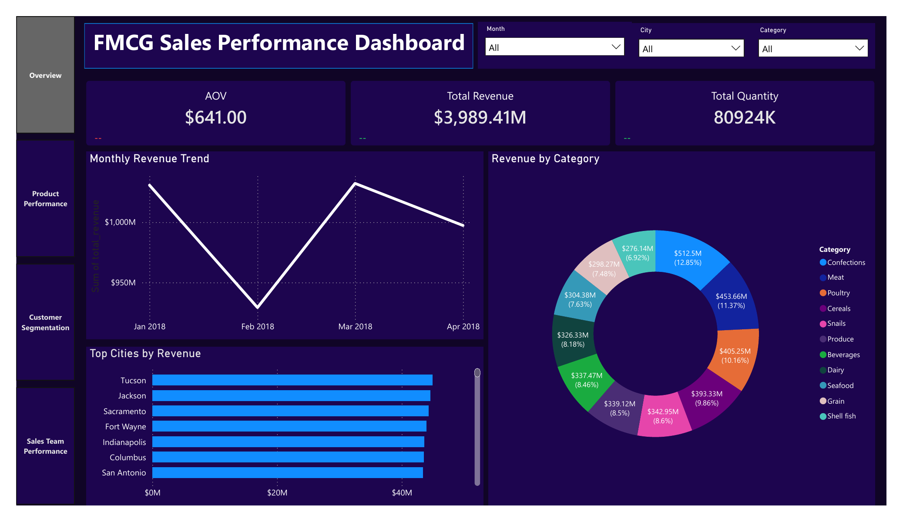
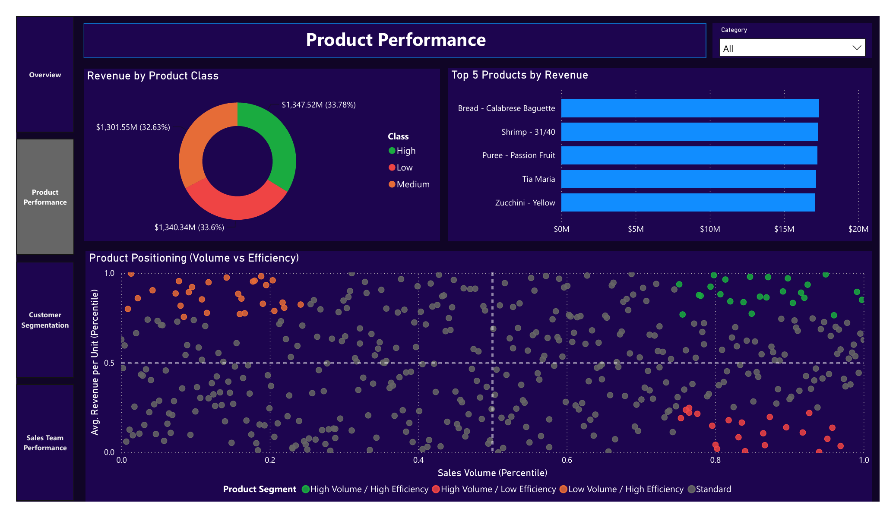
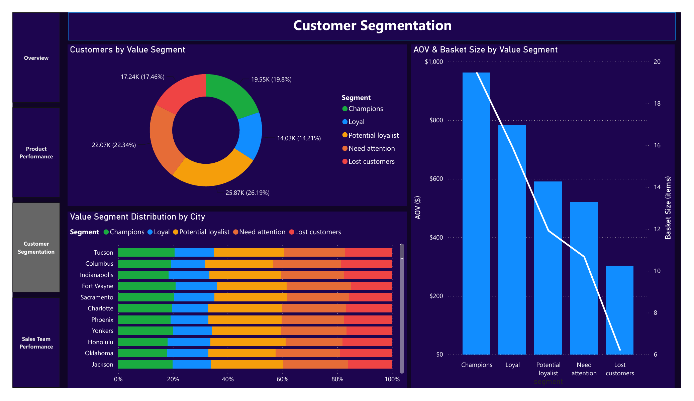
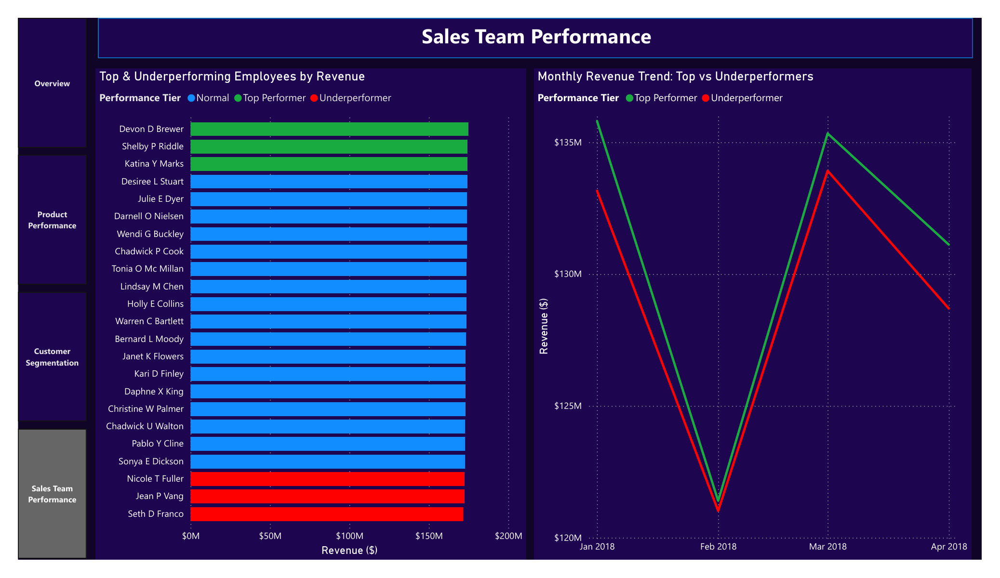
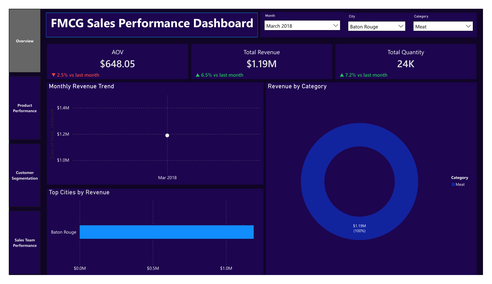
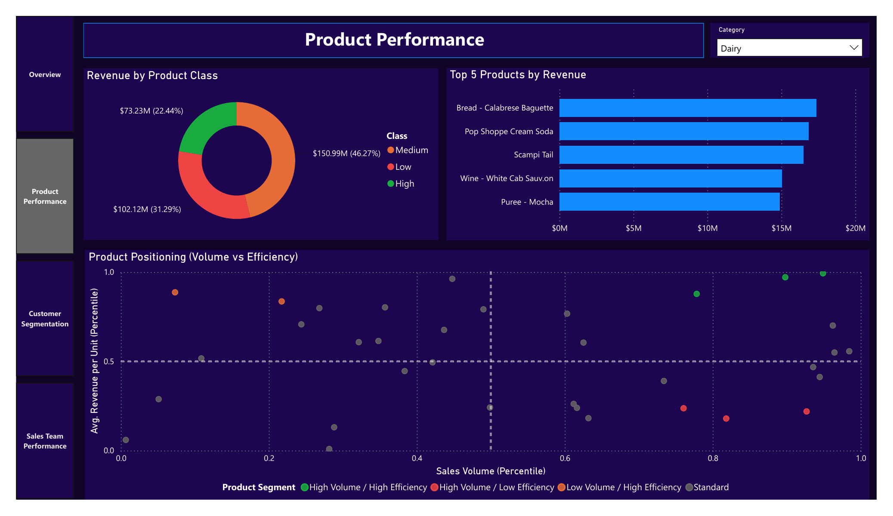

# FMCG Sales Performance Dashboard: A SQL-to-Power-BI Analytics Pipeline

*Simulated dataset (Grocery Sales Database). Not real company data.*

## Executive Summary

This project builds and evaluates a sales performance dashboard for a simulated FMCG
retailer, covering revenue, product, customer and sales-team performance from January to
April 2018.

The dataset contains 6,758,125 raw transaction rows across 7 tables. It is cleaned and
filtered to 6,223,697 valid transactions, then aggregated into 8 SQL views feeding a 4-page
Power BI dashboard.

Results show clear, dashboard-confirmed patterns at the product and customer level. Category,
city and employee-level totals are more even than expected.

## Business Context

* Scenario: 4 stakeholder groups ask different questions of the same 6.76M-row table.
   * Leadership: is revenue growing or shrinking?
   * Merchandising: which products earn their shelf space?
   * Marketing/CRM: who are our customers?
   * HR: who is over- or under-performing?
* This assumes the raw table can answer these directly.
* In practice, it needs cleaning and aggregation first (see Approach), and is too large to
  query ad hoc.

-> Each question was mapped to one SQL view and one dashboard page.

## Approach

* Dataset: Grocery Sales Database (simulated), 7 CSV tables, 6,758,125 sales rows.
* Cleaned: recomputed `TotalPrice` from `Price x Quantity x (1 - Discount)`, dropped null
  `SalesDate` rows (under 5%), limited to Jan 1 to Apr 30, 2018.
* Methods: PostgreSQL schema with foreign keys, window functions (`RANK`, `NTILE`,
  `PERCENT_RANK`, `LAG`), 8 pre-aggregated SQL views, Power BI Import mode with 3 DAX bridge
  tables (`Dim_Month`, `Dim_City`, `Dim_Category`), DAX trend measures.
* Evaluation: dashboard figures cross-checked against an independent CSV recomputation,
  headline totals matched exactly. Filtered screenshots confirm Overview and Product
  Performance cross-filter correctly across every visual; Customer Segmentation and Sales
  Team Performance have no working filter bar yet.

## Results

* Total revenue $3,989.41M, AOV $641.00, units sold 80.9M (Overview, screenshot 1).
* Monthly revenue: Jan $1,030.7M, Feb $929.2M, Mar $1,032.2M, Apr $997.3M. Daily rate is flat
  once divided by days per month, around $33.2M to $33.3M.
* Top 5 products range $17.08M to $17.38M, bottom 5 range $7.8K to $205K (Product Performance,
  screenshot 2).
* 98,759 customers split into 5 value segments, AOV and basket size falling in the same order
  (Customer Segmentation, screenshot 3).
* 23 employees range $174.9M to $171.7M, under 2% apart. Top and bottom trend lines move
  together, gap ranges $0.4M to $2.6M across the 4 months (Sales Team Performance,
  screenshot 4).

-> Totals are even across category, city and employee. The differences worth acting on sit at
the product and customer level.

## Key Insights

* Product Performance: unit volume across all 452 products sits in a narrow band (174K to
  184K, average 179K, under 1% standard deviation), so the revenue gap between the top and
  bottom sellers comes from price, not from how often the product sells. The 22 products
  flagged as High Volume/Low Efficiency (180K to 182K units each) are only "high volume" in
  a relative sense, at the top of that narrow band, not in a dramatically larger sense; their
  revenue per unit is what puts them in the bottom quartile of efficiency.
* Customer Segmentation: Need attention and Lost customers together make up 39.8% of the
  customer base, more than Champions and Loyal combined at 34.0%. AOV and basket size decline
  in the same order as the segments, which confirms the split reflects real spending behavior
  rather than statistical noise.
* Sales Team Performance: top and bottom employees rise and fall together every month, but the
  gap between them is not fixed. It runs $2.6M in January, narrows to $0.4M in February,
  reopens to $1.4M in March and widens again to $2.4M in April, which points to a shared
  monthly cycle rather than a stable, individual performance difference.

## Business Implications

* Category and city-level totals are too even to guide decisions alone.
* 22 high-volume, low-efficiency products are candidates for pricing review.
* 39.8% of customers sit in lower-value segments, a retention target.

-> Pair aggregate dashboards with product- and customer-level drill-down before deciding.

## Recommendations

* Review the 22 high-volume, low-efficiency products for pricing or delisting.
* Target Need attention and Lost customers with a retention campaign.
* Add a seasonally adjusted employee metric before using this for HR decisions.
* Add cost or margin data so profitability, not just revenue, can be measured.

## Limitations

* Dataset is simulated, not real transaction data.
* No cost or margin data; all figures are revenue only.
* Every customer made repeat purchases, 28 to 96 times; no one-time buyers to compare.
* Narrow city-to-city and employee-to-employee spreads suggest an evenly or synthetically
  generated dataset.

-> Findings demonstrate method, not conclusions about a real retailer.

## Skills Demonstrated

* SQL: schema design, foreign keys, window functions, CTEs, view design for BI.
* Data cleaning: found and corrected a systematically invalid revenue column.
* Power BI: Import-mode modeling, shared dimension tables, DAX measures, cross-filtering.
* Validation: independently recomputed dashboard totals from raw source data.
* Business interpretation: translated chart output into audience-specific insight.

## Dashboard Screenshots, Default View

## Dashboard Screenshots, Filtered View

Only Overview and Product Performance have a working filter bar.

## Files

* `dashboard/dashboard.pbix`: the Power BI file.
* `dashboard/dashboard.pdf`, `dashboard/dashboard_filter_version.pdf`: full-page exports, default
  and filtered.
* `dataset/Data Dictionary (EN).xlsx`: table and column reference, plus data quality notes.
* `dataset/Dataset/`, `dataset/Schema.png`: source CSVs and the entity-relationship diagram.
* `screenshots/`: individual dashboard page exports used in this document.
